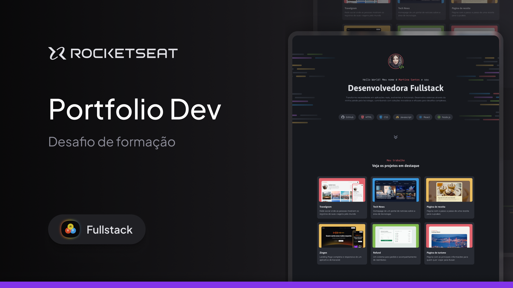

# 💻 Portfólio – Desenvolvedora Fullstack

Projeto de **site pessoal de portfólio** desenvolvido para apresentar habilidades, projetos e formas de contato, com foco em **design moderno**, **experiência do usuário** e **identidade visual profissional**.

## 📸 Pré-visualização

Interface de portfólio em tema escuro, com:
- Seção de apresentação profissional
- Destaque para projetos principais
- Navegação lateral
- Área de serviços e contato

## 🛠 Tecnologias utilizadas
- HTML5
- CSS3
- JavaScript
- Design responsivo
- Conceitos de UI/UX

## ✨ Características do projeto
- Layout moderno com tema dark
- Apresentação clara do perfil profissional
- Cards de projetos em destaque
- Navegação intuitiva entre seções
- Seção de serviços oferecidos
- Área de contato integrada
- Interface adaptada para diferentes tamanhos de tela

## ▶️ Como visualizar o projeto
1. Baixe ou clone este repositório
2. Abra o arquivo `index.html` no navegador

## 📚 Aprendizados
- Estruturação de um site de portfólio profissional
- Organização de conteúdo e hierarquia visual
- Criação de layouts modernos
- Melhoria da experiência do usuário
- Aplicação de identidade visual pessoal

## 🚀 Próximos passos
- Adicionar animações e microinterações
- Integrar formulário de contato funcional
- Otimizar performance e SEO
- Publicar o projeto online
